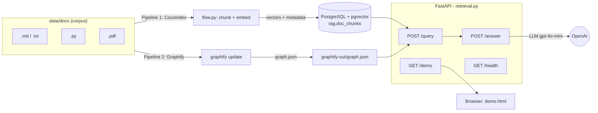
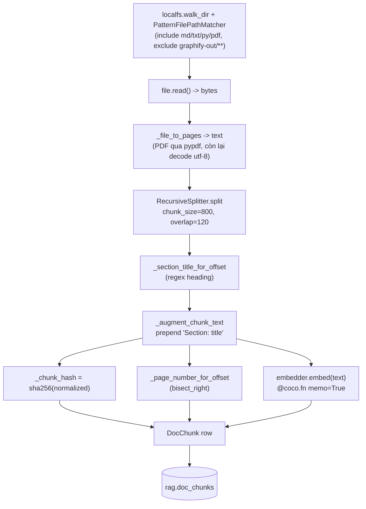
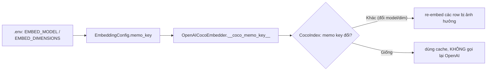
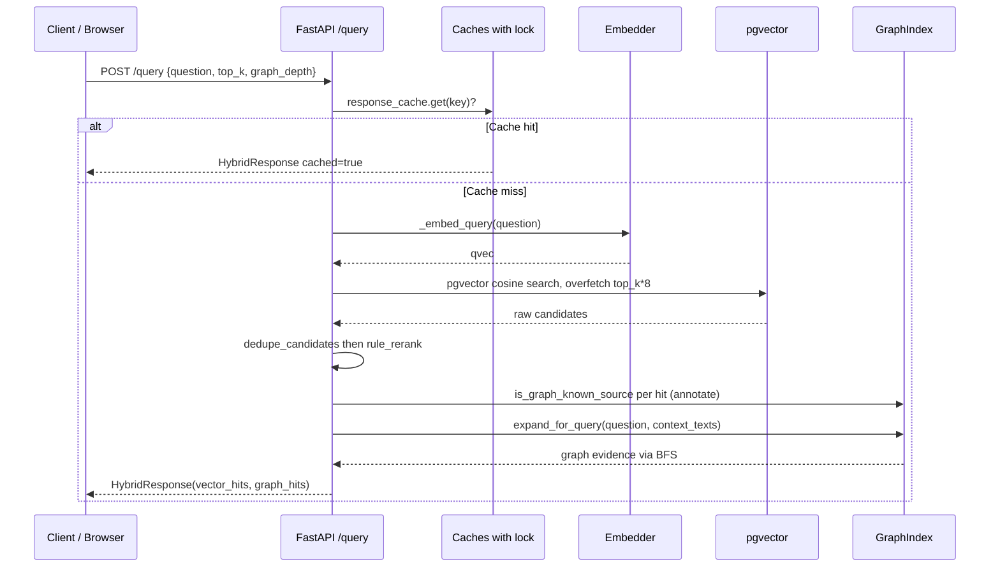
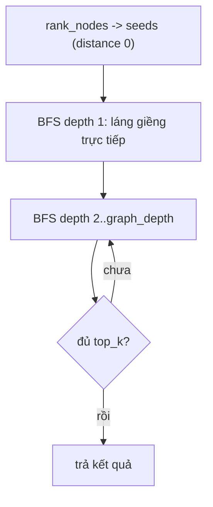
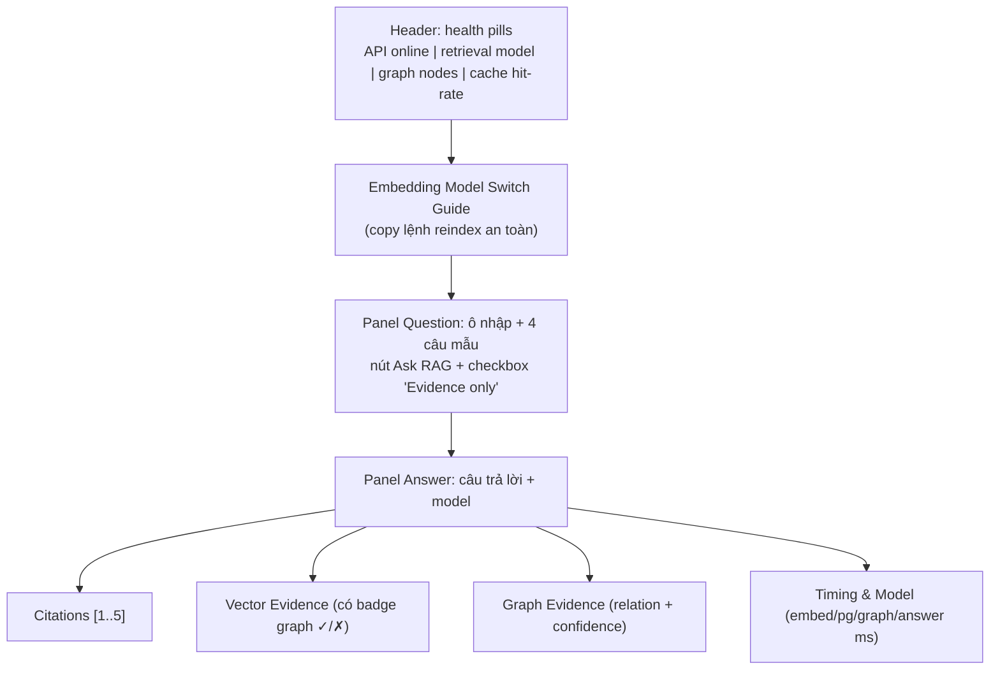
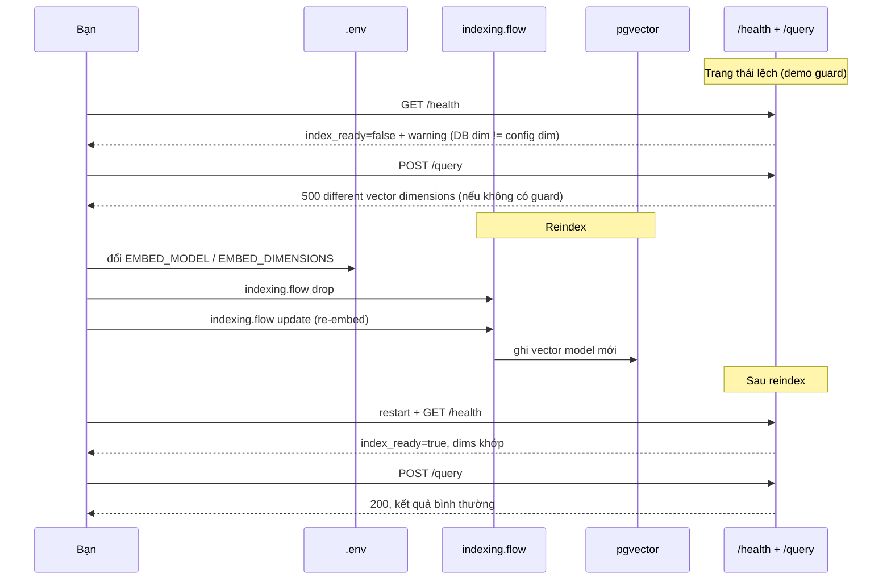

# Hướng dẫn chi tiết phần Core — Reindexable Hybrid RAG

> Mục tiêu: giúp bạn **hiểu sâu** từng phần đã implement (thuật toán, hàm, cấu trúc), **tự demo trên UI**, và **trả lời mentor** về CocoIndex và Graphify. Mọi giải thích đều trỏ tới file/hàm thật trong repo để bạn mở ra đối chiếu.

## Mục lục

1. [Bức tranh tổng thể (Strategy B)](#1-bức-tranh-tổng-thể-strategy-b)
2. [CocoIndex là gì và vì sao dùng](#2-cocoindex-là-gì-và-vì-sao-dùng)
3. [Graphify là gì và vì sao dùng](#3-graphify-là-gì-và-vì-sao-dùng)
4. [Pipeline Indexing chi tiết (flow.py)](#4-pipeline-indexing-chi-tiết-flowpy)
5. [Embedding config và cơ chế reindex (embedding_config.py)](#5-embedding-config-và-cơ-chế-reindex-embedding_configpy)
6. [Pipeline Retrieval chi tiết (retrieval.py)](#6-pipeline-retrieval-chi-tiết-retrievalpy)
7. [Rerank deterministic (rerank.py)](#7-rerank-deterministic-rerankpy)
8. [Graph retrieval (graph_retrieval.py)](#8-graph-retrieval-graph_retrievalpy)
9. [Answer generation (answering.py)](#9-answer-generation-answeringpy)
10. [Cách demo trên UI](#10-cách-demo-trên-ui)
11. [Demo reindex — phần "đắt giá" nhất](#11-demo-reindex--phần-đắt-giá-nhất)
12. [Cheat-sheet + Q&A mentor hay hỏi](#12-cheat-sheet--qa-mentor-hay-hỏi)

---

## 1. Bức tranh tổng thể (Strategy B)

Hệ thống tách thành **hai pipeline song song** đọc cùng một corpus (`data/docs`), nhưng phục vụ hai loại bằng chứng khác nhau, rồi hợp nhất ở tầng API:



**Hai nguồn bằng chứng (evidence):**

| Nguồn | Trả lời câu hỏi gì | Lưu ở đâu | Sinh bởi |
| --- | --- | --- | --- |
| **Vector evidence** | "Đoạn văn nào *giống nghĩa* câu hỏi nhất?" | `rag.doc_chunks` (pgvector) | CocoIndex |
| **Graph evidence** | "Khái niệm này *liên quan* tới khái niệm nào, với độ tin cậy nào?" | `graph.json` | Graphify |

**Vì sao tách đôi (Strategy B), không nhồi tất cả vào một pipeline?**

- Đổi embedding model chỉ ảnh hưởng **vector index**, không bắt buộc build lại graph → reindex rẻ hơn.
- Graphify giữ đúng vai trò trích xuất graph, không bị biến thành "tài liệu phụ" để index nhầm.
- Nhược điểm: hai pipeline có thể **drift** (lệch nhau) — POC đo bằng `scripts/drift_test.py`, và tầng API xử lý drift bằng cờ `graph_known` (mục 6).

---

## 2. CocoIndex là gì và vì sao dùng

**CocoIndex** là framework **incremental indexing**: bạn khai báo một "flow" (luồng biến đổi dữ liệu từ source → target), CocoIndex lo phần **chạy lại tối thiểu** khi dữ liệu hoặc code thay đổi.

Ba khái niệm cốt lõi (mentor hay hỏi):

1. **Target state / declarative**: bạn không viết "INSERT/UPDATE/DELETE" thủ công. Bạn khai báo *trạng thái đích* (mỗi file → các chunk row). CocoIndex so trạng thái hiện tại với đích và tự sync. Xem `app_main` trong `src/indexing/flow.py` dùng `postgres.mount_table_target` + `coco.mount_each`.

2. **Memoization (ghi nhớ kết quả)**: các hàm gắn `@coco.fn(memo=True)` được cache theo *nội dung input + "version" của code/logic*. Nếu input và logic không đổi → lấy kết quả cũ, không chạy lại (không gọi lại OpenAI). Đây là lý do `embed` được bọc `@coco.fn(memo=True, ...)`.

3. **Lifecycle `update / live / drop`**:
   - `update`: sync một lần (chạy phần thay đổi).
   - `live`: theo dõi file thay đổi và sync liên tục.
   - `drop`: xoá target + state để build lại sạch.

   Xem khối `if __name__ == "__main__"` cuối `src/indexing/flow.py`.

> **Một câu chốt cho mentor:** "CocoIndex cho tôi *reindexability* gần như miễn phí — khi đổi model embedding, tôi không phải tự viết logic 'row nào cần re-embed'; memo key của embedder đổi thì CocoIndex tự backfill đúng các row bị ảnh hưởng."

---

## 3. Graphify là gì và vì sao dùng

**Graphify** đọc corpus và trích xuất **knowledge graph**: các *node* (khái niệm/thực thể) và *edge* (quan hệ giữa chúng), kèm **confidence** và **nguồn**. Chạy bằng CLI `graphify update data/docs`, sinh ra:

```
data/docs/graphify-out/graph.json        # dữ liệu graph (nodes + edges)
data/docs/graphify-out/GRAPH_REPORT.md   # báo cáo người đọc
data/docs/graphify-out/graph.html        # graph xem trực quan
```

Cấu trúc `graph.json` thực tế trong repo (kiểm bằng cách mở file):

- **node** keys: `id`, `label`, `norm_label`, `file_type`, `source_file`, `source_location`, `community`.
- **edge** keys: `source`/`target`, `relation`, `confidence` (vd `EXTRACTED`/`INFERRED`/`AMBIGUOUS`), `confidence_score`, `source_file`, `source_location`.

**Vì sao graph evidence có giá trị với LLM?** Vector chỉ trả "đoạn giống nghĩa". Graph trả thêm *quan hệ có nhãn + độ tin cậy + nguồn* — ví dụ `HybridRetriever --connects--> VectorStore (confidence=EXTRACTED, source=sample_code.py)`. Thông tin có cấu trúc này giúp câu trả lời của LLM chính xác và truy nguồn được.

> **Điểm tinh tế quan trọng (mentor rất thích hỏi):** Graphify **không ingest PDF** trong setup này — graph chỉ phủ `.md`/`.py`. Đây chính là lý do tầng API có cờ `graph_known` (mục 6): vector hit từ PDF sẽ `graph_known=False` nhưng **không bị loại bỏ**.

---

## 4. Pipeline Indexing chi tiết (flow.py)

File: `src/indexing/flow.py`. Đây là CocoIndex flow biến corpus thành các vector row.



### 4.1 Lọc file đầu vào — `build_path_matcher`

```python
INCLUDED_PATTERNS = ["**/*.md", "**/*.txt", "**/*.py", "**/*.pdf"]
EXCLUDED_PATTERNS = ["graphify-out/**", "**/graphify-out/**"]
```

**Vì sao exclude `graphify-out/**`?** Nếu không, hệ thống sẽ index chính report của Graphify → "tự index output của mình", làm nhiễu kết quả. (Bài học #4 trong README.)

### 4.2 Đọc file → text theo trang — `_file_to_pages`, `_page_starts`

- PDF: dùng `pypdf.PdfReader`, mỗi trang `page.extract_text()`.
- Text/MD/PY: decode UTF-8 (`errors="replace"`).
- `text = "\n\n".join(pages)` — nối các trang bằng 2 ký tự xuống dòng.
- `_page_starts(pages)`: tính **offset bắt đầu của mỗi trang** trong chuỗi `text` đã nối. Vì nối bằng `"\n\n"` (2 ký tự) nên offset cộng dồn `len(page) + 2`.

### 4.3 Map offset → số trang — `_page_number_for_offset` (thuật toán: binary search)

```python
from bisect import bisect_right
def _page_number_for_offset(page_starts, offset):
    if not page_starts:
        return None
    return max(1, bisect_right(page_starts, offset))
```

**Giải thích:** `page_starts` là mảng tăng dần `[0, len_p1+2, ...]`. `bisect_right` tìm vị trí chèn `offset` → chính là **số trang (1-based)** chứa offset đó. Độ phức tạp `O(log P)` thay vì quét tuyến tính. Đây là cách gán `page_number` cho mỗi chunk để citation chỉ đúng trang PDF.

### 4.4 Chunking — `RecursiveSplitter`

```python
chunks = _splitter.split(text, chunk_size=800, chunk_overlap=120, language=_split_lang(ext))
```

- `chunk_size=800`, `chunk_overlap=120`: mỗi chunk ~800 ký tự, gối nhau 120 để không cắt mất ngữ cảnh ở biên.
- `language`: `.py` → `python`, còn lại → `markdown` (splitter ưu tiên cắt theo cấu trúc heading/hàm).
- Mỗi `chunk` có `chunk.start.char_offset` / `chunk.end.char_offset` — offset vào `text`, dùng cho section + page.

### 4.5 Phát hiện tiêu đề mục — `_section_title_for_offset` (thuật toán)

```python
SECTION_HEADING_RE = re.compile(r"(?m)^(?:#{1,6}\s+.+|\d+\.\s+[A-Z][^\n]{2,120})$")
```

Regex bắt 2 dạng heading: Markdown `# ... ######` **hoặc** dạng đánh số `1. Tiêu Đề`. Hàm quét tất cả heading, lấy **heading gần nhất *trước* offset của chunk** (current), fallback là heading *đầu tiên nằm trong* khoảng chunk. → mỗi chunk biết nó thuộc mục nào.

### 4.6 Tăng cường text + băm — `_augment_chunk_text`, `_chunk_hash`

- `_augment_chunk_text`: **prepend `"Section: <title>\n"`** vào chunk trước khi embed. Lý do (bài học #7): heading ảnh hưởng mạnh tới embedding, giúp query theo chủ đề khớp đúng đoạn.
- `_chunk_hash`: `sha256` của text đã chuẩn hoá (`casefold` + gộp whitespace). Dùng để **dedupe** ở tầng retrieval và phát hiện chunk trùng.

### 4.7 Embed + ghi row — `process_chunk` / `DocChunk`

`DocChunk` map 1-1 sang cột bảng `rag.doc_chunks`:

```
id, source_path, file_type, chunk_start, chunk_end, text,
chunk_hash, section_title, page_number, model_name, embedding
```

- `embedding=await embedder.embed(chunk_text)` — embedder do `create_indexing_embedder` chọn theo provider.
- `model_name = EMBED_CONFIG.model_name_for_storage` (vd `openai:text-embedding-3-large:3072`) — **lưu kèm row** để biết row được embed bằng model nào (cực kỳ quan trọng cho guard reindex, mục 6.6).

---

## 5. Embedding config và cơ chế reindex (embedding_config.py)

File: `src/embedding_config.py`.

### 5.1 Resolve config từ env — `embedding_config_from_env`

Đọc `.env`: `EMBED_PROVIDER`, `EMBED_MODEL`, `EMBED_DIMENSIONS`, `OPENAI_API_KEY`,... Nếu thiếu thì suy luận (model bắt đầu `text-embedding-` → provider `openai`; dimension mặc định theo bảng `OPENAI_EMBED_DIMENSIONS`).

### 5.2 Trái tim của reindex — `memo_key` và `model_name_for_storage`

```python
@property
def model_name_for_storage(self) -> str:
    return f"{self.provider}:{self.model}:{self.dimensions}"

@property
def memo_key(self):
    return (self.provider, self.model, self.dimensions, self.base_url.rstrip("/"))
```

`OpenAICocoEmbedder.__coco_memo_key__()` trả về chính `memo_key` này. CocoIndex dùng nó để quyết định re-embed:



→ Đổi model → `memo_key` đổi → reindex. Cùng config → key ổn định → không re-embed thừa. **Đây là điều `tests/test_embedding_config.py` assert** (test rẻ, không cần DB/OpenAI).

### 5.3 OpenAI client tự viết — `OpenAIEmbeddingClient`

Dùng `httpx` thuần (tránh lock-in SDK). Có **retry với exponential backoff**: `sleep = 0.25 * (2**attempt)`, chỉ retry khi lỗi *tạm thời* (`ConnectError`, `ReadTimeout`, `429`, `5xx`). Payload gửi kèm `dimensions` cho dòng `text-embedding-3-*`. Parse xong **kiểm tra đúng số chiều**, sai thì raise ngay.

---

## 6. Pipeline Retrieval chi tiết (retrieval.py)

File: `src/api/retrieval.py`. Endpoints: `/health`, `/query`, `/answer`, `/demo`.



### 6.1 Hai tầng cache + thread-safety

- `_embed_cache`: cache **vector của câu hỏi** (key = text câu hỏi). Tránh gọi lại OpenAI cho query lặp.
- `_response_cache`: cache **cả response** (key = `(question, top_k, graph_depth, model_name, graph.mtime)`). Lưu ý có `graph.mtime` trong key → graph build lại thì cache tự vô hiệu.
- Cả hai bọc `threading.Lock` vì `/query` chạy trong threadpool (nhiều thread song song). Eviction kiểu LRU đơn giản: đầy thì `pop(next(iter(cache)))` (bỏ phần tử cũ nhất).

### 6.2 Embed câu hỏi — `_embed_query`

Đọc cache; miss thì gọi embedder (OpenAI hoặc sentence-transformers) **ngoài lock** (vì chậm), rồi ghi cache trong lock.

### 6.3 Tìm vector bằng pgvector — câu SQL cốt lõi

```sql
SELECT source_path, text,
       1 - (embedding <=> %s::vector) AS score,   -- cosine similarity
       chunk_hash, section_title, page_number
FROM rag.doc_chunks
WHERE source_path NOT LIKE '%graphify-out%'       -- chặn artifact lọt vào
ORDER BY embedding <=> %s::vector                  -- cosine distance tăng dần
LIMIT %s                                            -- top_k * 8 (overfetch)
```

**Giải thích thuật toán:**
- `<=>` là toán tử **cosine distance** của pgvector. `1 - distance` = **cosine similarity** (càng gần 1 càng giống). `ORDER BY <=>` = sắp theo khoảng cách nhỏ nhất.
- **Overfetch `top_k * 8`**: lấy dư 8 lần rồi mới dedupe + rerank, để bước rerank có đủ ứng viên chọn lọc (bài học #6, #8).

### 6.4 Dedupe + rerank

`candidates = rule_rerank(question, dedupe_candidates(raw_candidates))` — chi tiết ở [mục 7](#7-rerank-deterministic-rerankpy). Lấy `candidates[:top_k]` làm `vector_hits`.

### 6.5 Graph cross-validation — cờ `graph_known` (KHÔNG phá huỷ)

```python
graph_corpus_known = bool(graph.known_source_files)
graph_known = graph.is_graph_known_source(path) if graph_corpus_known else None
```

- `graph_known=True`: source doc **có** trong graph (graph corroborate).
- `graph_known=False`: source doc **ngoài** phạm vi graph (vd PDF) — **vẫn giữ hit, không drop**.
- `graph_known=None`: graph rỗng, không cross-check được.

`HybridResponse.graph_known_doc_filter_applied = graph_corpus_known` — báo cho client biết cross-check đã chạy.

> **Vì sao không "lọc cứng"?** Vì PDF không nằm trong graph → lọc cứng sẽ vứt bằng chứng PDF và làm hỏng tính năng long-PDF. Annotate thay vì drop là cách an toàn cho Strategy B (hai pipeline phủ corpus khác nhau).

### 6.6 Guard reindex ở `/health` — `_db_embedding_info`

`/health` query DB lấy `vector_dims(embedding)` + `model_name` thực tế, so với config:
- Khớp → `index_ready=true`.
- Lệch (đổi model mà chưa reindex) → `index_ready=false` + `warnings` chỉ rõ cần `drop + update`.

→ Biến lỗi 500 *runtime* (`different vector dimensions`) thành **cảnh báo sớm, có hướng dẫn**.

---

## 7. Rerank deterministic (rerank.py)

File: `src/api/rerank.py`. Hai hàm chính.

### 7.1 `dedupe_candidates` — gộp trùng, giữ điểm cao nhất, giữ thứ tự

- Key dedupe = `chunk_hash` (fallback: text đã normalize).
- Với mỗi key, giữ candidate có `vector_score` cao nhất, nhưng **giữ vị trí xuất hiện đầu tiên** (ổn định thứ tự).

### 7.2 `rule_rerank` — công thức tính điểm (thuộc lòng để demo)

```python
rerank_score = (
    candidate.vector_score          # nền: độ giống vector
    + section_overlap * 0.06        # số token query trùng với SECTION TITLE
    + text_overlap    * 0.01        # số token query trùng với nội dung chunk
    + section_phrase_bonus          # +0.03 mỗi token (len>4) xuất hiện nguyên trong section title
)
```

**Triết lý:** vector_score là chính; ba số hạng cộng thêm là *tín hiệu từ vựng* (lexical) để ưu tiên chunk mà **tiêu đề mục** khớp câu hỏi — trọng số section (0.06) > nội dung (0.01) vì heading mang tính chủ đề mạnh hơn. Tokenize bỏ stopword, giữ token >2 ký tự, và "gộp" các từ kiểu `re-index → reindex`.

Sắp xếp cuối: theo `rerank_score` giảm dần, hoà thì theo `vector_score`, rồi `source_path`, rồi hash → **hoàn toàn tất định** (cùng input luôn ra cùng thứ tự, dễ kiểm thử).

> Đây là **baseline**; production có thể thay bằng cross-encoder reranker khi đã có golden dataset (mục Giới hạn của README).

---

## 8. Graph retrieval (graph_retrieval.py)

File: `src/api/graph_retrieval.py`. Lớp `GraphIndex`.

### 8.1 Load graph — `_load`

Đọc `graph.json` → dựng:
- `self.nodes`: dict `node_id -> node`.
- `self.adj`: **danh sách kề (adjacency list)** — graph **vô hướng** (mỗi edge thêm cả 2 chiều).
- `self.known_source_files`: tập tên file mà graph biết (dùng cho `graph_known`).
- `self._node_terms`: token hoá sẵn mỗi node để match nhanh.
- `self.mtime`: để `maybe_reload()` tự nạp lại khi `graph.json` mới hơn.

### 8.2 Token hoá — `tokenize_for_graph`

```python
folded = _fold_ascii(text)   # bỏ dấu + casefold (NFKD)
# tách "compact term": re-index -> reindex, HybridRetriever -> hybridretriever
# + token thường, bỏ stopword, giữ len > 1
```

Mục đích: cho `re-index`, `Re-index`, `reindex` đều match về cùng dạng.

### 8.3 Chấm điểm node — `rank_nodes` (công thức)

```python
score = len(query_overlap) * 3.0   # token câu hỏi trùng term của node  (trọng số cao nhất)
      + len(context_overlap) * 1.0 # token từ vector hits trùng term node (ngữ cảnh)
# + 1.5 cho mỗi token query (len>3) xuất hiện trong label/compact_label
```

→ Node được "seed" (điểm vào graph) dựa trên **cả câu hỏi lẫn ngữ cảnh vector hits**. Sắp giảm dần theo score, tie-break tất định theo `source_file`/`label`.

### 8.4 Mở rộng láng giềng — `expand_for_query` (thuật toán BFS theo độ sâu)



- Bắt đầu từ các seed (distance 0).
- Với mỗi mức độ sâu `1..graph_depth`: duyệt frontier, lấy node kề chưa thăm, gắn `distance`, `relation`, `confidence`, `source_file` từ **edge**.
- `seen` chống lặp; dừng sớm khi đủ `top_k`.
- Kết quả trả về dạng `GraphEvidence` — chính là `graph_hits` trong response.

### 8.5 `is_graph_known_source`

Chuẩn hoá path; nếu nằm trong `graphify-out/` → False; nếu graph không có known files → True (không cross-check được); còn lại: True nếu **tên file** thuộc `known_source_files`. Đây là hàm cấp tín hiệu cho cờ `graph_known` ở mục 6.5.

---

## 9. Answer generation (answering.py)

File: `src/api/answering.py`. `/answer` = `/query` + sinh câu trả lời có nguồn.

1. **`build_citations`**: từ `vector_hits`, dedupe theo `(source_path, section_title, page_number)`, cắt snippet ~320 ký tự, đánh số `[1] [2] ...` (tối đa 5).
2. **`build_answer_messages`**: dựng prompt gồm *system* ("chỉ dùng evidence được cấp, trích dẫn `[n]`, thiếu thì nói thẳng") + *user* (câu hỏi + citation evidence + graph evidence).
3. **`OpenAIChatClient.complete`**: gọi `chat/completions` (`gpt-4o-mini`, `temperature=0.2`), cùng cơ chế retry như embedding client.
4. **Fallback an toàn**: nếu không có citation nào → trả `fallback_answer` (không bịa).

> Điểm "grounded": câu trả lời **bắt buộc dựa trên evidence truy xuất được**, mọi claim gắn `[n]` → chống hallucination, truy nguồn được.

---

## 10. Cách demo trên UI

Mở `http://127.0.0.1:8003/demo` (sau khi chạy `\.scripts\serve_demo.ps1`). Bố cục và thứ tự nên trình bày với mentor:



**Kịch bản demo 5 bước:**

1. **Chỉ vào health pills** — chứng minh API online, model embedding hiện tại, số graph node, cache hit-rate. Nói: "đây là tầng quan sát realtime."
2. **Bấm 1 câu mẫu** (vd "How does the system reindex when embedding model changes?") → **Ask RAG**.
3. **Giải thích Answer + Citations** — câu trả lời có `[1] [2]`, mỗi citation chỉ rõ file + section + trang.
4. **Chỉ vào Vector Evidence** — đọc `rerank_score` và đặc biệt **badge `graph ✓/✗`**: nói "PDF hiện `✗` vì Graphify không ingest PDF, nhưng ta **vẫn giữ** bằng chứng PDF — đây là cross-validation không phá huỷ."
5. **Tick 'Evidence only (no LLM)'** rồi Ask lại → "chế độ này gọi `/query`, **không tốn tiền LLM**, dùng để demo tầng retrieval thuần." So sánh timing (không có `answer_ms`).

---

## 11. Demo reindex — phần "đắt giá" nhất

Đây là luận điểm trung tâm của project. Kịch bản chứng minh **end-to-end**:



**Lệnh chạy** (xem chi tiết README mục "Đổi embedding model và reindex"):

```powershell
# 1) Sửa .env: EMBED_MODEL + EMBED_DIMENSIONS
# 2) Rebuild
$env:PYTHONPATH="src"
.\.venv\Scripts\python.exe -m indexing.flow drop
.\.venv\Scripts\python.exe -m indexing.flow update
# 3) Restart API rồi Invoke-RestMethod .../health  -> index_ready=true, dims mới
```

**Hoặc tự động hoá** bằng `scripts/reindex_test.py` (build từng model rồi assert DB `vector_dims` + `model_name`):

```powershell
.\.venv\Scripts\python.exe scripts\reindex_test.py `
  --models text-embedding-3-small:1536,text-embedding-3-large:3072 `
  --out reports\reindex_test.json
```

**Điểm nhấn nói với mentor:** "Reindexability không chỉ là chạy lại embedding. Đổi *dimension* là **migration schema vector** (cột `vector(N)` cố định) → POC dùng `drop + update`; production dùng shadow table/column. Cùng dimension thì chỉ cần `update` (memo key đổi → CocoIndex re-embed tại chỗ)."

---

## 12. Cheat-sheet + Q&A mentor hay hỏi

### Bản đồ file → trách nhiệm

| File | Trách nhiệm | Thuật toán/điểm nhấn |
| --- | --- | --- |
| `src/indexing/flow.py` | CocoIndex flow: corpus → vector rows | chunk 800/120, section regex, page bisect, sha256 hash, memo embed |
| `src/embedding_config.py` | Config + OpenAI embed client | `memo_key` (reindex trigger), retry backoff |
| `src/api/retrieval.py` | API + query orchestration | pgvector cosine `<=>`, overfetch x8, cache+lock, `graph_known`, health guard |
| `src/api/rerank.py` | Dedupe + rerank tất định | công thức `vec + 0.06·sec + 0.01·text + bonus` |
| `src/api/graph_retrieval.py` | Query graph.json | tokenize fold-ascii, `rank_nodes` (x3/x1/+1.5), BFS `expand_for_query` |
| `src/api/answering.py` | Sinh answer + citations | grounded prompt, fallback an toàn |
| `src/api/static/demo.html` | UI demo | Evidence-only toggle, badge `graph_known`, banner cảnh báo |

### Q&A dự kiến

- **"Vì sao tách CocoIndex và Graphify?"** → Strategy B: đổi model chỉ ảnh hưởng vector index, không phải build lại graph; mỗi tool giữ đúng vai trò; đánh đổi là drift, đã đo bằng `drift_test.py`.
- **"Reindex hoạt động thế nào ở mức code?"** → `memo_key=(provider,model,dim,base_url)`; đổi model → key đổi → CocoIndex re-embed các row bị ảnh hưởng; `model_name` lưu kèm row để `/health` phát hiện lệch.
- **"Cosine similarity tính ở đâu?"** → trong SQL: `1 - (embedding <=> qvec)`; `<=>` là cosine distance của pgvector.
- **"Rerank dùng ML không?"** → Không, baseline tất định bằng lexical overlap (section/text) + vector_score; chứng minh bằng report; production có thể thêm cross-encoder.
- **"PDF có trong graph không? Sao vector hit PDF không bị loại?"** → Graphify không ingest PDF; ta annotate `graph_known=False` thay vì drop để không mất bằng chứng PDF.
- **"Nếu đổi model mà quên reindex thì sao?"** → `/health` báo `index_ready=false` + hướng dẫn; nếu vẫn query thì pgvector raise dimension mismatch (fail an toàn, không trả kết quả sai).
- **"Đổi dimension khác gì đổi model cùng dimension?"** → Khác dimension = migration schema (drop+update); cùng dimension = chỉ update (re-embed tại chỗ).

### Lệnh nhanh

```powershell
# Khởi động toàn bộ demo (1 lệnh)
.\scripts\serve_demo.ps1

# Kiểm tra sức khoẻ + trạng thái index
Invoke-RestMethod http://127.0.0.1:8003/health

# Test reindex tự động
.\.venv\Scripts\python.exe scripts\reindex_test.py --out reports\reindex_test.json

# Chạy unit test (gồm test cơ chế reindex)
.\.venv\Scripts\python.exe -m unittest discover -s tests
```

---

*Tài liệu này đi kèm `README.md` (vận hành) và `docs/architecture-diagram.svg` (sơ đồ kiến trúc gốc). Mở các file nguồn trong bảng trên để đối chiếu khi học.*
